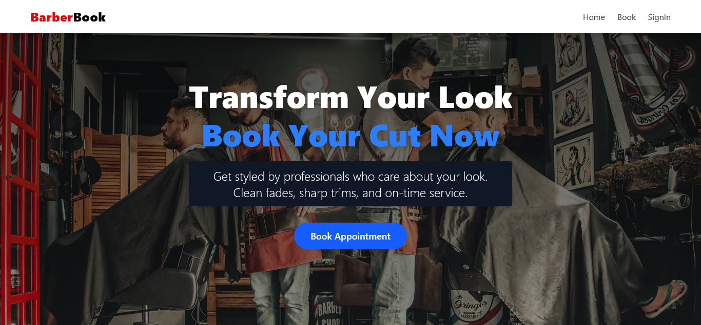

# 💈 Barber Booking Website

A modern web application that allows users to book appointments with barbers online. The project aims to provide a smooth, user-friendly experience for clients and barbers alike.

---

### 🌐 Features

- 🧑‍💼 Admin dashboard for barbers
- 📅 Book appointments online
- 📲 Responsive design for all devices
- 🔒 Secure login and registration (optional)
- 📍 Display location and opening hours

---

### 🛠️ Tech Stack

- **Frontend:** React, Tailwind CSS
- **Backend:** Node.js, Express (if applicable)
- **Database:** Firebase (if applicable)
- **Routing:** React Router
- **Deployment:** Vercel

---

### 📸 Screenshots

### Links
- Live at: https://barber-application-fawn.vercel.app/ 
